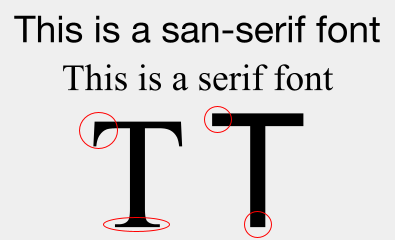

# fonts
- TODO: how to solve boxes
- TODO: generate font specimens
- TODO: fill out all sections
- TODO: make font index separate, and have previews for fonts that are licensed appropriately, have tags (has emoji/icons/CJK, is bitmap/has sizes)
- TODO:

```
### vector/bitmap
#### bitmap
  - scaling issues
  - kitty
  - vector variants (like in cozette)
  - no-bitmaps fontconfig
### display fonts
### condensed
### CJK, icon, and emoji fonts (or "why do I only see boxes")
### ligatures
### font metrics (weight, ascent, descent, baseline)
### fontconfig and x font system
```

## how to install fonts
There are two main ways to install fonts:
- From your package manager
- Downloaded from a website

Installing from your package manager is generally preferable to downloading them, but if you do download them, put the ttf/bdf/otf files in `~/.fonts/` then run `fc-cache -fv` to reload the font list.

## using fonts & fontconfig
Fontconfig is the system responsible for looking up font files from font names in most linux software. It requires exact names to function.

Finding the fontconfig names of fonts can be done using `fc-match` and `fc-list`:

```
$ fc-match "go monospace" # make sure to use quotes with fc-match
FiraCode-Regular.ttf: "Fira Code" "Regular"
$ # this is not the font we asked for, so we will search through the list of all fonts
$ fc-list | grep -i "go"
<omitted output>
/usr/share/fonts/TTF/Go-Mono.ttf: Go Mono:style=Regular
/usr/share/fonts/TTF/Go-Medium-Italic.ttf: Go Medium:style=Italic
/usr/share/fonts/TTF/Go-Mono-Italic.ttf: Go Mono:style=Italic
<omitted output>
$ # we can see the name of the font after the colon, "Go Mono"
$ fc-match "Go Mono" # test if fc-match returns the correct file
Go-Mono.ttf: "Go Mono" "Regular
```

TODO: pixelsize and style

## glossary
### serif/sans-serif

Serif fonts have fancy endings to their lines and varying line weight, while sans-serif fonts do not.



### monospace/proportional

Monospace fonts have every character use the same width. Some grid-based applications like terminals require monospaced fonts to work properly. There is no downside to using monospace fonts in other applications, but some people find that they look odd outside of a terminal.

Proportional fonts can have each character use a different width, and are the most common.

`This is monospaced` and this is proportional.


## font collections
This wiki maintains its own font index, available at [here](https://wooosh.github.io/themewiki/fontindex/)

Other font collections:

- [Old School PC Fonts](https://int10h.org/oldschool-pc-fonts/fontlist/)
- [Classic MacOS Fonts](https://github.com/JohnDDuncanIII/macfonts)
- [Tecate's Bitmap Fonts](https://github.com/Tecate/bitmap-fonts)
- [Google Fonts](https://fonts.google.com/)
- [Nerd Fonts](https://github.com/ryanoasis/nerd-fonts)

### emoji fonts
- [Twemoji](https://twemoji.twitter.com/)
- [Noto Color Emoji](https://www.google.com/get/noto/help/emoji/)
- Apple Color Emoji
